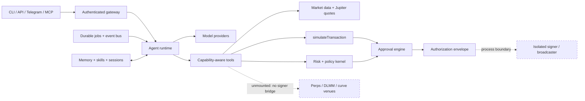

<div align="center">

# RetifyOS

**The Operating System for Autonomous AI**

An infrastructure layer for autonomous AI agents: persistent memory, capability-scoped tools, durable workers, event and market data, approval workflows, and a hardened execution boundary.

[](LICENSE)
[](#installation)
[](#development)

<sub>Built by <a href="https://github.com/venymlabs">Venym Labs</a></sub>

</div>

<br>

<table>
<tr><td>

**Contents** — [Why RetifyOS Exists](#why-RetifyOS-exists) · [Overview](#overview) · [Architecture](#architecture) · [Core Concepts](#core-concepts) · [Features](#features) · [Installation](#installation) · [Configuration](#configuration) · [Usage](#usage) · [Production Trading](#production-trading) · [Operator Console](#operator-console) · [Telegram](#telegram) · [Durable Workers](#durable-workers) · [Security Boundary](#the-security-boundary) · [Development](#development) · [Project Structure](#project-structure) · [Roadmap](#roadmap) · [Philosophy](#philosophy) · [License](#license)

</td></tr>
</table>

> **Important — Live trading.** RetifyOS supports funded Solana mainnet-beta execution through an isolated, policy-constrained signer. Live mode is triple-opt-in and is not safe by default: verify the build, audit the signer policy and every program ID it allows, use a dedicated minimally funded wallet, and follow the [trading runbook](docs/TRADING.md). Passing tests is not a security audit.

**Production quickstart:** verify the clone, run `npm run setup:trading -- --account <pubkey> --rpc <url>`, create the keystore with `npm run signer -- create`, then configure the signer, approval keys, API, and recovery loop exactly as described in the [trading runbook](docs/TRADING.md). Supported lifecycle commands include `trade quote`, `buy`/`sell`, `revoke`, `approve`/`deny`, `submit`, `status`, and `reconcile`. Delegate revokes flow through the same exact-transaction approval and isolated-signer pipeline as swaps.

---

## Why RetifyOS Exists

Most agent runtimes are a prompt wrapped around an API client. That is fine for a demo. It is a bad place to put capital, and a fragile place to put anything an agent is meant to keep doing unattended.

An autonomous agent needs infrastructure it does not have to trust its own model to provide: somewhere to remember, a bounded way to act, a way to coordinate with people and other systems, a way to recover after a crash, and a way to prove what it did. If that infrastructure lives inside the model's trust domain, every prompt injection is a privilege escalation.

RetifyOS is that infrastructure. It treats the model as an untrusted planner and keeps the deterministic parts — policy, persistence, simulation, approvals, signing — in the host. The result is an agent runtime that can stay online, recover after a restart, process events, and explain what it wants to do without becoming the custodian of the wallet it is meant to protect.

---

## Overview

RetifyOS is one package with a small, explicit production dependency set. The composition root wires an application from independent stores and ports; the CLI, the HTTP server, the worker, and the Telegram runner are thin entrypoints over that same application.

The shipped runtime provides:

| Component | Description |
|---|---|
| **Model routing** | Across OpenAI-compatible providers, including self-hosted models, with fallback policies, bounded tool loops, cancellation, and budgets |
| **Cognition** | Durable memory, filesystem skills, session history, full-text search, and context compression |
| **Durable autonomy** | A SQLite-backed job queue with cron schedules, leases, fencing tokens, bounded retries, dead letters, and event triggers |
| **Tool registry** | Capability-aware, exposed both to the agent loop and over MCP, with declared capabilities, effects, schemas, timeouts, and availability |
| **Market data & risk** | Cluster reads, Jupiter quoting, exact rational OHLCV aggregation, and exposure/concentration/drawdown/liquidity checks |
| **Control plane** | A deterministic policy kernel, durable input-leg reservations, exact-transaction approvals, simulation against a pinned recent blockhash, and one-time authorization envelopes |
| **Isolated signer** | Signer and broadcaster run in a separate process, outside the API/model process |
| **Interfaces** | An authenticated Fastify API with resumable SSE, a local/remote CLI, and a Telegram long-poll adapter |

---

## Architecture

RetifyOS separates intelligence from execution. The conceptual layer, mapped to what actually exists in this repository:

| Layer | Status | In this repository |
|---|---|---|
| **LLMs** | Implemented | Provider-neutral model routing over OpenAI-compatible endpoints, including local servers |
| **RetifyOS Core** | Implemented | `src/agent/`, `src/app/`, `src/gateway/`, `src/kernel/` — orchestration, protocol, tool registry |
| **Tools** | Implemented | `src/agent/tools/`, `src/mcp/`, `src/chains/solana/`, `src/perps/`, `src/pools/` |
| **Memory** | Implemented | `src/cognition/` — durable memory, skills, sessions, FTS search, context compression |
| **Workers** | Implemented | `src/autonomy/` — job queue, cron schedules, leases, event bus, delegation |
| **Indexing** | Partial | `src/data/` aggregates market tape and OHLCV; there is no general launchpad/chain indexer in this repo |
| **Messaging** | Implemented | `src/gateway/channels/`, `src/telegram/`, plus HTTP + SSE |
| **Security** | Implemented | `src/execution/`, `src/kernel/policy-engine.ts`, `src/live-trading/`, the isolated signer in `src/bin/signer.ts` |

Two boundaries carry most of the weight:

- **The deterministic control plane** owns canonical intent normalization, policy, reservations, simulation, approval, authorization, and reconciliation.
- **The isolated signer process** owns the encrypted keystore and takes an authorization envelope rather than raw bytes. It independently decodes the transaction, verifies policy and authorization claims, rechecks that the recent blockhash has not expired, and atomically consumes the one-time envelope before signing and broadcasting.

### Architecture diagram



The dashed edge matters. The shipped signer process owns the encrypted keystore outside the API/model process. Blockhash expiry is terminal: an expired request fails closed and needs a fresh authorization, never a silent re-sign.

---

## Core Concepts

**Intelligence vs. execution.** Reasoning is probabilistic; moving funds must not be. RetifyOS keeps the model outside the trusted computing base. The model may propose a typed `TradeIntent`; it never receives signing material, arbitrary instruction data, unrestricted RPC writes, or the ability to mutate policy or replay an authorization envelope.

**Agents.** An agent is a bounded loop over the shared model router and tool registry: iteration, token and cost budgets, cancellation, and parallel read-only tool execution. Durable runs persist their events so a client can resume a run over SSE. The loop is stateless with respect to trust — it holds no keypair and no broadcaster.

**Tools.** Tools are registered with a name, input/output schemas, a capability requirement, an effect (`read`/`write`), a timeout, and an availability condition. Invocation is checked against the caller's granted capability set; a tool outside the set is not even listed. The same registry backs the MCP server, so an MCP client sees exactly the capabilities the composition root granted it.

**Memory.** Memory is durable and local (`node:sqlite`): revision-checked batches, secret scanning, byte budgets, and per-session snapshots. Filesystem skills are discovered and loaded explicitly; sessions and their history are searchable via full-text search. Context compilation prunes whole tool exchanges so a result is never orphaned from its call, protects head, tail and financial messages by kind, and redacts secrets before any summarizer sees them.

**Workers.** Durable work runs through a SQLite job queue with leases and fencing tokens. Events are ordered per consumer; retries are bounded; poison work is dead-lettered; unfinished state survives process restarts. Cron schedules, event triggers, and bounded subagents run on the same substrate.

**Indexing.** `src/data/` maintains a market tape and exact rational OHLCV aggregation, and `src/autonomy/events` retains reorg-correction machinery. There is no general chain or launchpad indexer in this repository: nothing currently produces chain events into the reorg store. This layer is partial by design.

**Messaging.** Communication is exposed through a bearer-authenticated HTTP API with resumable SSE, a Telegram long-poll adapter that is default-deny and stores its update offset before dispatch, and an MCP stdio transport for tool access. Actors are identified by durable IDs, never by display names.

**Security.** Controls are independent by design (see [The security boundary](#the-security-boundary)). The model never receives signing material; tools declare capabilities and effects; plugins start from a closed capability allowlist; reservations count pending exposure before another trade can pass policy; approvals bind an authenticated operator to an exact transaction and simulation; authorization envelopes are short-lived, one-time, and replay-protected; the isolated signer rechecks program IDs, instruction discriminators, per-asset input-leg caps, cluster, authorization, replay state, and recent-blockhash expiry; and missing or unhealthy dependencies fail closed.

---

## Features

Implemented and exercised in this repository:

| Layer | Included |
|---|---|
| Agent runtime | Provider-neutral model routing, fallback policies, bounded tool loops, cancellation, budgets |
| Cognition | Durable memory, skills, session history, FTS search, context compression |
| Autonomy | SQLite job queue, cron schedules, leases, fencing, retries, dead letters, event triggers |
| Market data | Cluster reads, Jupiter quoting, exact rational OHLCV aggregation |
| Risk | Exposure, concentration, drawdown, slippage, liquidity and oracle checks |
| Controls | Deterministic policy kernel, durable input-leg reservations, exact-transaction approvals |
| Simulation | `simulateTransaction` against a pinned recent blockhash, with provenance and evidence hashing |
| Authorization | One-time envelopes bound to transaction, recent blockhash, policy, approval, and simulation |
| Swaps | Jupiter quote to simulation to approval to authorization to isolated signer, end to end |
| Perps and pools | Drift v2 and Meteora DLMM adapters plus a pump.fun bonding-curve client — read the caveat below |
| Interfaces | Authenticated Fastify API, resumable SSE, local/remote CLI, Telegram long polling, MCP stdio |
| Extensibility | Signed plugin manifests, capability mediation, isolated plugin workers |
| Console | Self-served operator dashboard on the daemon's own origin, strict CSP, session auth |
| Operations | Health, metrics, audit roots, Docker, Compose, systemd units, migration tools |

> **What "included" means for perps and pools.** The `perps_*`, `pools_*` and `pumpfun_*` toolsets are implemented and unit-tested against fakes, but they have never run against live Drift or Meteora infrastructure. `@drift-labs/sdk` and `@meteora-ag/dlmm` are optional peer dependencies, so a default install does not even have them on disk. They also do not mount without a `WalletProvider`, and the composition root deliberately supplies none: the isolated signer takes an authorization envelope rather than raw bytes, and the bridge from one to the other does not exist yet. In the shipped daemon these tools are therefore not registered and not reachable — the correct default for an unproven venue, not an oversight. The swap path is the one wired end to end.

---

## Installation

RetifyOS requires **Node.js 22 or newer**.

```bash
git clone https://github.com/RetifyOS/RetifyOS.git
cd RetifyOS
npm ci
npm run verify
npm run build
```

---

## Configuration

### Quick start

Start with a private local data directory and an API token:

```bash
export DATA_DIR="$HOME/.local/state/RetifyOS"
export NETWORK=testnet
export EXECUTION_MODE=read-only
export API_BEARER_TOKEN="replace-this-with-a-long-random-token"
export API_SCOPES="agent:read,agent:write,tool:read,tool:invoke,simulation:invoke"

npm start
```

Operational endpoints are public so a local supervisor can probe them. Application routes require bearer authentication and fail closed when no token is configured.

### Cluster access

RPC-backed tools remain unavailable until an RPC endpoint is configured.

```bash
export RPC_URL="https://your-devnet-rpc.example"
```

The cluster is derived from `NETWORK`, never configured beside it: `mainnet` selects `mainnet-beta`, `testnet` selects `devnet` — the cluster operators actually rehearse on, since Solana's own testnet is a validator-release cluster. There is no separate cluster variable to fall out of step with the network, and no chain id.

At startup RetifyOS calls `getGenesisHash` and compares it with the expected hash for that cluster. An endpoint that answers but reports a different cluster — a devnet URL left in a mainnet deployment — is reported unhealthy and the process never becomes ready. An unrecognised genesis hash is unhealthy too: unknown is not a pass.

Mainnet cannot be selected accidentally. It requires both flags:

```bash
export NETWORK=mainnet
export MAINNET_ENABLED=true
export MAINNET_ACKNOWLEDGE_RISK=I_ACKNOWLEDGE_MAINNET_RISK
```

This unlocks mainnet selection only. Funded execution additionally requires `EXECUTION_MODE=live`, `LIVE_TRADING_ENABLED=true`, `LIVE_TRADING_ACKNOWLEDGE_RISK=I_ACKNOWLEDGE_LIVE_TRADING_RISK`, trading limits/account, private approval and authorization key files, and the isolated signer. See [Production trading](docs/TRADING.md).

### The model endpoint

Nothing plans until an OpenAI-compatible endpoint is configured. Naming any `LLM_*` variable declares the intent to run a planner, and from there the required values are required — a key with no model, or a base URL with no provider, is refused at boot rather than surfacing as a 404 on the first turn.

```bash
export LLM_PROVIDER=openai            # or openrouter, groq, together, xai, deepseek
export LLM_MODEL=gpt-4.1-mini
export LLM_API_KEY="sk-..."           # required for a hosted provider
```

A self-hosted server is a first-class provider, not a fallback. Run llama.cpp behind Lemonade, Ollama, or `llama-server` and the model reasoning over your positions never leaves your network:

```bash
export LLM_PROVIDER=lemonade          # or ollama, llama-cpp
export LLM_BASE_URL="http://192.168.1.91:8000/api/v1"
export LLM_MODEL=Qwen3-8B-GGUF
export LLM_CONTEXT_WINDOW=8192
export LLM_MAX_OUTPUT_TOKENS=1024
# LLM_API_KEY is optional here, and usually absent.
```

A local provider may be reached over plain HTTP and may hold no API key at all — over your own LAN there is no credential in flight and no vendor to authenticate to. A hosted provider fails closed on both counts: it must present `LLM_API_KEY`, and its base URL must be HTTPS, because a bearer token must never cross a network in cleartext. The key is held in a `Secret`, so it cannot reach a log, a JSON body, or an inspector; `config:check`, `/v1/health` and the console report the provider and model, never the endpoint URL or key.

`LLM_BASE_URL` is optional when the provider's default endpoint is right, and each provider carries its own request-body extras. `lemonade` sends `chat_template_kwargs.enable_thinking = false`, which suppresses a reasoning model's thinking trace — roughly a 4x output-token saving on tool-routing steps. Adding a provider means adding a row to `LLM_PROVIDERS` in `src/config/index.ts`; the transport never learns any provider's name, and these extras are merged under the canonical OpenAI fields, so no provider profile can redefine the model, the transcript, or the tool set.

| Variable | Default | Meaning |
| --- | --- | --- |
| `LLM_PROVIDER` | — | `openai`, `openrouter`, `groq`, `together`, `xai`, `deepseek`, `lemonade`, `ollama`, `llama-cpp` |
| `LLM_MODEL` | — | Model id, as the endpoint names it |
| `LLM_BASE_URL` | provider default | OpenAI-compatible base URL; no query string, fragment, or embedded credentials |
| `LLM_API_KEY` | — | Required for a hosted provider, optional for a local one |
| `LLM_CONTEXT_WINDOW` | `8192` | Window the router budgets against |
| `LLM_MAX_OUTPUT_TOKENS` | `1024` | Ceiling per completion; must be below the window |
| `LLM_INPUT_COST_PER_MILLION` | `0` | Cost the router orders candidates by |
| `LLM_OUTPUT_COST_PER_MILLION` | `0` | As above, for output tokens |

---

## Usage

### CLI

The package exposes `raos`, `raos-signer`, `raos-telegram`, and `raos-mcp`.

```bash
# Local mode: opens the configured local state
npm run cli -- status
npm run cli -- sessions
npm run cli -- tools
npm run cli -- markets
npm run cli -- jobs

# Remote mode: talks to a running RetifyOS server
raos --remote http://127.0.0.1:8787 \
  --token "$API_BEARER_TOKEN" \
  sessions

# Simulation input can be inline, a file, or stdin
raos simulate '{"transaction":{}}'
raos simulate @request.json
cat request.json | raos simulate -
```

Every command returns a stable JSON envelope:

```json
{"ok":true,"result":{}}
```

If a dependency is missing, RetifyOS says so. It does not substitute plausible empty market data or synthetic simulation results.

Check the running process:

```bash
curl -fsS http://127.0.0.1:8787/livez
curl -fsS http://127.0.0.1:8787/readyz
curl -fsS http://127.0.0.1:8787/version
```

### API surface

The standalone server provides:

| Route | Purpose | Authentication |
|---|---|---|
| `GET /livez` | Process liveness | Public |
| `GET /readyz` | Dependency readiness | Public |
| `GET /metrics` | Prometheus-style metrics | Public |
| `GET /version` | Build and runtime metadata | Public |
| `GET /v1/health` | Application health | Public |
| `GET /v1/sessions` | Durable sessions | Scoped bearer token |
| `GET /v1/tools` | Available tool schemas | Scoped bearer token |
| `POST /v1/tools/:name/invoke` | Capability-checked invocation | Scoped bearer token |
| `GET /v1/markets` | Configured market tools | Scoped bearer token |
| `GET /v1/jobs` | Durable job state | Scoped bearer token |
| `POST /v1/simulate` | Read-only transaction simulation | Scoped bearer token |
| `POST /v1/runs` | Start an asynchronous agent run | Scoped bearer token |
| `GET /v1/runs/:id/events` | Resume run events over SSE | Scoped bearer token |
| `POST /v1/trading/quote` | Quote and pin an exact simulated transaction | `trading:quote` |
| `POST /v1/trading/execute` | Create an idempotent dry-run/live execution | `trading:execute` |
| `POST /v1/trading/revoke` | Create an idempotent SPL delegate-revoke execution | `trading:execute` |
| `GET /v1/trading/executions/:id` | Read durable execution/approval state | `trading:read` |
| `POST /v1/trading/executions/:id/approve` | Submit operator approval proof | `trading:approve` |
| `POST /v1/trading/executions/:id/submit` | Authorize, sign, and broadcast | `trading:submit` |
| `POST /v1/trading/reconcile` | Recover and reconcile pending executions | `trading:reconcile` |
| `GET /` | Operator console (single-page app) | Public shell, authenticated data |
| `POST /api/session` | Exchange the bearer token for a session cookie | Bearer token |
| `GET /api/snapshot` | One console snapshot | `agent:read` |
| `GET /api/stream` | Console snapshots over SSE | `agent:read` |
| `GET /api/sources` | Which snapshot panels are backed by a real source | `agent:read` |
| `POST /api/policy/kill-switch` | Engage or release the kernel hard stop | `trading:execute` |
| `POST /api/policy/execution` | Arm or disarm execution (dry-run toggle) | `trading:execute` |
| `POST /api/approvals/:id/decide` | Decide one pending intent | `trading:approve` |
| `POST /api/strategies/:id/status` | Pause or resume a strategy runner | `trading:execute` |

Bind the server to localhost by default. Put it behind TLS and a trusted identity-aware reverse proxy before exposing it to a network.

---

## Production Trading

Live trading is a separate, explicit workflow. The full procedure is in the [trading runbook](docs/TRADING.md); the essentials:

```bash
# 1. Initialize private setup artifacts (mode 0600)
npm run setup:trading -- --account <yourDedicatedWalletPubkey> --rpc https://YOUR_MAINNET_RPC

# 2. Create the signer keystore and inspect it
npm run signer -- create --keystore "$DATA_DIR/wallet.json" --password-fd 0
npm run signer -- status --keystore "$DATA_DIR/wallet.json"

# 3. Run the isolated signer (separate supervised process)
npm run signer -- serve \
  --keystore "$DATA_DIR/wallet.json" --password-fd 3 \
  --socket "$SIGNER_SOCKET_PATH" --token "$SIGNER_TOKEN_PATH" \
  --policy "$SIGNER_POLICY_PATH" --db "$DATA_DIR/signer.sqlite" \
  --authorization-key "$AUTHORIZATION_KEY_PATH" \
  --key-id "$AUTHORIZATION_KEY_ID" --rpc "$RPC_URL" \
  3<"$DATA_DIR/password.in"

# 4. Quote, approve, submit, and reconcile
npm run cli -- trade quote --side buy \
  --token-in <inputMint> --token-out <outputMint> --amount-in 1000000 --slippage 50
npm run cli -- trade buy --quote-id <quoteId> --idempotency-key buy-001 --actor strategy --live
npm run cli -- trade approve --id <executionId>
npm run cli -- trade submit --id <executionId>
npm run cli -- trade reconcile --id <executionId>
```

> **Caution.** Never retry an uncertain order with a new idempotency key. Query its execution ID and reconcile it first.

---

## Operator Console

The daemon serves its own control panel. One process: `npm start` and the console is at `http://127.0.0.1:8787/`, its API at `/api` on the same origin. There is no second deployment and no CORS.

```bash
npm run dashboard:build   # builds web/ into web/dist (shipped in the package)
npm start                 # serves the console and the API from one port
```

The console is served under `default-src 'self'` with no external host in the policy: the typefaces are self-hosted, the film grain is an inline `data:` URI, and `connect-src` is this origin only.

Authentication is the existing bearer token. A browser cannot set an `Authorization` header on `EventSource`, so `/login` exchanges the token once for an `HttpOnly; SameSite=Strict` session cookie; every `/api` route also accepts `Authorization: Bearer` directly for curl and the CLI. With no `API_BEARER_TOKEN` or `API_BEARER_TOKEN_SHA256` configured, no session can be minted and every `/api` route refuses with `401 AUTH_NOT_CONFIGURED` — the approvals endpoint included. The console can lower authority but never raise it: `EXECUTION_MODE` remains the ceiling, so a browser session can disarm execution but cannot arm a process that was not started live.

`GET /api/sources` reports which panels are backed by a real source in this build. Approvals, strategies, signals, perp/DLMM position legs and USD valuation have no source in this repo yet and report an explicit unavailable state rather than a plausible-looking zero.

---

## Telegram

Telegram is optional and default-deny. The runner stores its update offset before dispatch, preventing replay after a restart.

```bash
export TELEGRAM_BOT_TOKEN="..."
export TELEGRAM_ALLOWED_USER_IDS="123456789"
export TELEGRAM_ALLOWED_CHAT_IDS="-1001234567890"
export RAOS_API_URL="http://127.0.0.1:8787"
export RAOS_API_TOKEN="$API_BEARER_TOKEN"

npm run telegram
```

RetifyOS identifies Telegram actors by numeric user and chat IDs, never usernames. An empty allowlist permits nobody.

---

## Durable Workers

```bash
# Apply/check local SQLite state
npm run db:migrate
npm run db:status
npm run db:integrity

# Process one durable job
npm run worker -- --once
```

Jobs use leases and fencing tokens. Events are ordered per consumer. Retries are bounded, poison work is dead-lettered, and unfinished state survives process restarts.

> **Note.** Do not horizontally scale SQLite writers against the same data directory. Use one writer set per state volume.

---

## The Security Boundary

RetifyOS assumes model output, plugins, RPC responses, token metadata, quote providers, and chat input may be malicious.

Controls are independent by design:

- The model never receives signing material.
- Tools declare capabilities, effects, schemas, timeouts, and availability.
- Plugins start from a closed capability allowlist.
- Reservations count pending exposure before another trade can pass policy.
- Approvals bind authenticated operators to an exact transaction and simulation.
- Authorization envelopes are short-lived, one-time, and replay protected.
- The isolated signer rechecks program IDs, instruction discriminators, per-asset input-leg caps, cluster, authorization, replay state, and recent-blockhash expiry.
- Audit events are append-only and can be anchored with Merkle roots.
- Missing or unhealthy dependencies fail closed.

### What RetifyOS does not claim

- It is not a general-purpose wallet; the signer is a narrow policy-constrained execution boundary.
- It does not make smart contracts safe.
- It does not remove oracle, validator, MEV, bridge, governance, or cluster risk.
- Passing tests is not a substitute for an external security audit.
- Funded execution remains operator-controlled and high risk; deployment requires explicit live opt-ins, exact-transaction approval, and an independently reviewed policy.

Read the full [security doctrine](docs/SECURITY.md) before extending the execution path.

---

## Development

```bash
npm test                 # Vitest
npm run typecheck        # strict TypeScript
npm run build            # clean production build
npm run verify           # tests + typecheck + build
npm audit --omit=dev     # production dependencies
npm pack --dry-run       # inspect the release artifact
```

The suite runs offline, against fakes and local SQLite. No test touches a live cluster, so a green suite says the logic holds — not that the venue integrations work.

The suite includes restart recovery, multi-connection SQLite races, stale-worker fencing, replay attempts, malformed RPC data, tenant isolation, forged approval proofs, exposure oversubscription, delegate-revoke lifecycle and tamper cases, package installation, and real subprocess entrypoints. CI runs the full verify pipeline on Ubuntu and Windows for every push and pull request.

---

## Project Structure

```text
src/
├── agent/          model routing, runtime, tool registry
├── autonomy/       jobs, schedules, event bus, delegation
├── cognition/      memory, skills, context compression
├── chains/solana/  RPC, Jupiter, broadcaster, local wallet, SPL
├── execution/      policy, approvals, simulation, authorization
├── gateway/        protocol, API, channel adapters
├── kernel/         trade gateway, policy engine, reconciler, durable store
├── live-trading/   the durable swap lifecycle and the signer client
├── market/         exact rational OHLCV aggregation
├── observability/  logs, metrics, health, audit roots
├── perps/          venue-agnostic perps port + Drift v2 adapter
├── pools/          Meteora DLMM, rebalancer, pump.fun bonding curve
├── plugins/        signed manifests and sandbox host
├── storage/        durable SQLite stores
├── telegram/       polling and offset management
├── control/        the operator console's API, auth, CSP and static serving
└── bin/            server-adjacent operational entrypoints

web/                the console itself: its own package, lockfile and audit
```

Deeper references:

- [Architecture](docs/ARCHITECTURE.md)
- [Security doctrine](docs/SECURITY.md)
- [Operator runbook](docs/OPERATIONS.md)
- [Production trading runbook](docs/TRADING.md)
- [Solana unification plan](docs/plans/2026-08-21-solana-unification.md)
- [Third-party notices](THIRD_PARTY_NOTICES.md)

---

## Roadmap

RetifyOS is honest about the line between what ships and what is only designed:

| Status | Scope |
|---|---|
| Implemented | The runtime, memory, durable workers, market data and risk, the policy kernel, simulation, approvals, authorization, the isolated signer, the swap lifecycle, the API/CLI/Telegram/MCP interfaces, and the operator console |
| Implemented but unmounted | The perps (`perps_*`), Meteora DLMM (`pools_*`) and pump.fun (`pumpfun_*`) toolsets. They are unit-tested against fakes but do not mount in the shipped daemon; see the warning above |
| Conceptual | A general indexer for chain/launchpad events, and a bridge from the isolated signer's authorization-envelope interface to a raw-bytes `WalletProvider` that would let the venue toolsets execute |

---

## Philosophy

**Separating intelligence from execution.** Intelligence — reasoning, understanding, planning, and decision making — belongs in models, and models change quickly. Execution — identity, capability, policy, persistence, simulation, and authorization — belongs in infrastructure, and must stay stable, auditable, and independent of whichever model is currently in favor.

**Swap intelligence. Keep infrastructure.** Because the model layer is untrusted and interchangeable, a new model or provider can be dropped in without rebuilding the surrounding system. The infrastructure keeps its contracts; the intelligence is free to evolve.

---

## License

RetifyOS is open source under the [MIT License](LICENSE).

<div align="center">
<sub>Built by <a href="https://github.com/venymlabs">Venym Labs</a></sub>
</div>